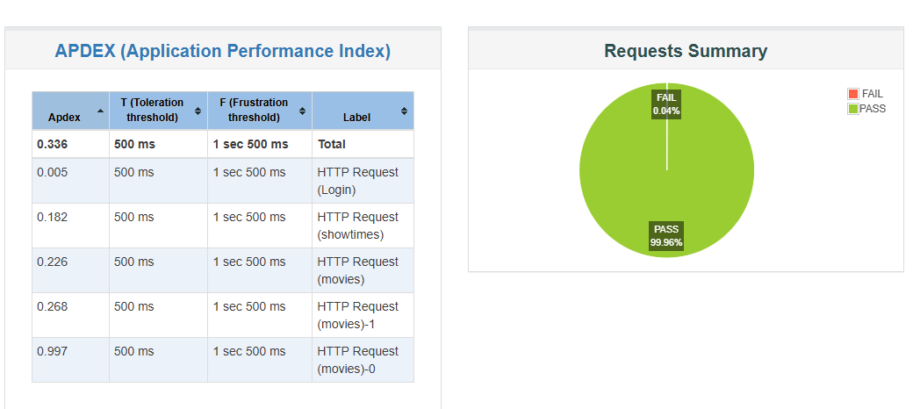
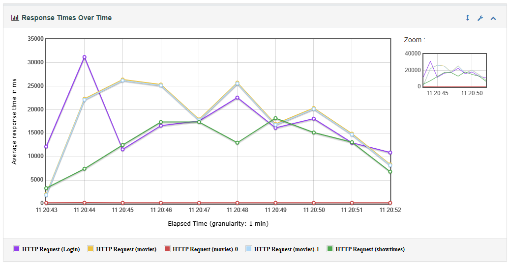

# UNIVERSIDAD DE LAS FUERZAS ARMADAS ESPE
## Departamento de Ciencias de la Computación

| MATERIA        | Pruebas de Software                           | NRC         | 27857                              | Prueba No. | 1    |
| :------------- | :-------------------------------------------- | :---------- | :--------------------------------- | :--------- | :--- |
| **CARRERA**    | Ingeniería de Software                        | **DOCENTE** | Ing. Luis Alberto Castillo Salinas |            |      |
| **TEMA**       | Evaluación de Pruebas de Rendimiento y Estrés |             |                                    |            |      |
| **ESTUDIANTE** | Pablo Zurita                                  |             |                                    |            |      |

---

## 1. Introducción
El aseguramiento de la calidad del software no solo implica la validación funcional mediante pruebas unitarias, sino también la verificación del comportamiento del sistema bajo condiciones de carga. Este informe detalla la ejecución de pruebas de estrés sobre el Sistema de Gestión de Cine, una aplicación web full-stack diseñada para gestionar películas, salas y funciones. Mediante el uso de Apache JMeter, se simula una concurrencia masiva de usuarios para identificar límites operativos y garantizar la estabilidad del servicio en un entorno de producción en la nube.

## 2. Objetivos
### 2.1. Objetivo General
Evaluar el rendimiento y la estabilidad del backend del Sistema de Cine ante una carga significativa de usuarios simultáneos para garantizar la disponibilidad del servicio.

### 2.2. Objetivos Específicos
*   Simular la concurrencia de 100 usuarios realizando operaciones críticas (Login, consulta de películas y showtimes).
*   Analizar los tiempos de respuesta y la tasa de error del servidor desplegado en Render.
*   Validar la correcta gestión de sesiones mediante tokens JWT bajo condiciones de estrés.

## 3. Alcance
La prueba se limita a los endpoints principales del backend:
*   `POST /api/users/login`: Validación de seguridad y generación de JWT.
*   `GET /api/movies`: Recuperación masiva de datos del catálogo.
*   `GET /api/showtimes`: Consulta de datos protegidos vinculados al usuario.
La prueba cubre hasta un volumen de 5,000 peticiones en un intervalo corto de tiempo.

## 4. Entorno de Pruebas
*   **Backend:** Node.js / Express (Desplegado en Render.com - Tier Gratuito).
*   **Base de Datos:** MongoDB Atlas (Cloud Cluster).
*   **Herramienta de Prueba:** Apache JMeter 5.6.3.
*   **Sistema Operativo:** Windows 10/11.
*   **Red:** Conexión de banda ancha estable para minimizar la latencia externa.

## 5. Pruebas de Rendimiento (JMeter)

### 5.1. Estrategia de la Prueba
Se configuró un **Thread Group** con las siguientes características para simular un pico de tráfico real:
*   **Usuarios Simultáneos:** 100 usuarios.
*   **Ramp-Up Period:** 10 segundos (entrada gradual de usuarios).
*   **Iteraciones:** 10 ciclos por cada hilo de usuario.
*   **Manejo de Sesión:** Extracción dinámica del token JWT desde la respuesta del Login y propagación automática mediante un Header Manager en las peticiones subsiguientes.

### 5.2. Métricas y Resultados Estadísticos

A continuación se detalla el comportamiento del sistema durante la ejecución:

| Etiqueta (Label)             | # Muestras | Promedio (ms) | Mediana (ms) |   90% Line    |   95% Line    |   99% Line    | Mín (ms) |  Máx (ms)  |  % Error  | Rendimiento (TPS) |
| :--------------------------- | :--------: | :-----------: | :----------: | :-----------: | :-----------: | :-----------: | :------: | :--------: | :-------: | :---------------: |
| **HTTP Request (Login)**     |    1000    |   17,351.81   |   4,598.50   |   51,566.50   |   56,509.65   |   70,550.09   |   824    |   75,076   |   0.10%   |       1.74        |
| **HTTP Request (movies)**    |    1000    |   19,391.43   |   1,680.00   |   52,970.80   |   55,884.30   |   65,513.76   |   400    |   73,900   |   0.00%   |       1.75        |
| **HTTP Request (showtimes)** |    1000    |   13,290.92   |   1,887.50   |   45,827.00   |   51,522.85   |   57,102.97   |   311    |   72,082   |   0.10%   |       1.75        |
| **Redirects/Internal**       |    2000    |   9,695.68    |    828.75    |   26,490.95   |   28,071.45   |   32,867.78   |   149    |   73,726   |   0.00%   |       3.50        |
| **TOTAL**                    |  **5000**  | **13,885.11** | **1,701.00** | **49,202.00** | **54,206.90** | **63,100.02** | **149**  | **75,076** | **0.04%** |     **8.71**      |

### 5.3. Evidencias Gráficas
A continuación se presentan las gráficas generadas por JMeter que respaldan el análisis estadístico anterior:

#### A. Resumen de Errores vs Éxitos (Dashboard)

*Gráfico 1: El 99.96% de las peticiones fueron procesadas exitosamente.*

#### B. Tiempos de Respuesta sobre el Tiempo (Response Times Over Time)

*Gráfico 2: Comportamiento de la latencia durante el incremento de carga.*

### 5.4. Análisis de Resultados
Se observa que la aplicación mantiene una integridad del **99.96%**, demostrando una alta fiabilidad en la lógica de negocio. Los tiempos de respuesta elevados son atribuidos a las limitaciones de CPU del tier gratuito de Render al procesar 100 hilos sin "Think Time", sin embargo, el sistema no colapsó y gestionó las colas de peticiones exitosamente.

